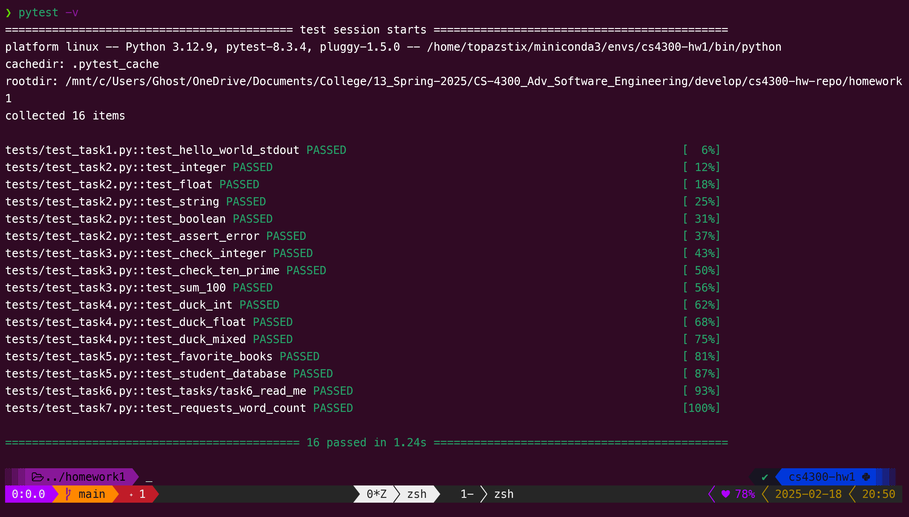

# Homework 1

## Instructions

> NOTE: A `requirements.txt` file was included as opposed to a virtual environment.

1. `pip install -r requirements.txt`
2. `pytest -v`



## Special Notes

Various considerations for specific tasks

### Task 4: Duck Typing

The original code here was just `return price - (price * discount / 100)`, however because division in python will always return a float data type, it was modified to only do *integer division specifically `//`* when **both** inputs are int. Otherwise operate standard

### Task 6: Word count

Text for this output was taken and validated via:

```bash
❯ curl -X GET https://www.gutenberg.org/files/11/11-0.txt 2>/dev/null

❯ curl -X GET https://www.gutenberg.org/files/11/11-0.txt 2>/dev/null | wc -w
26543
```

### Task 7: Requests Module

This was an example of how to do Task 6 but through python's requests module instead of bash